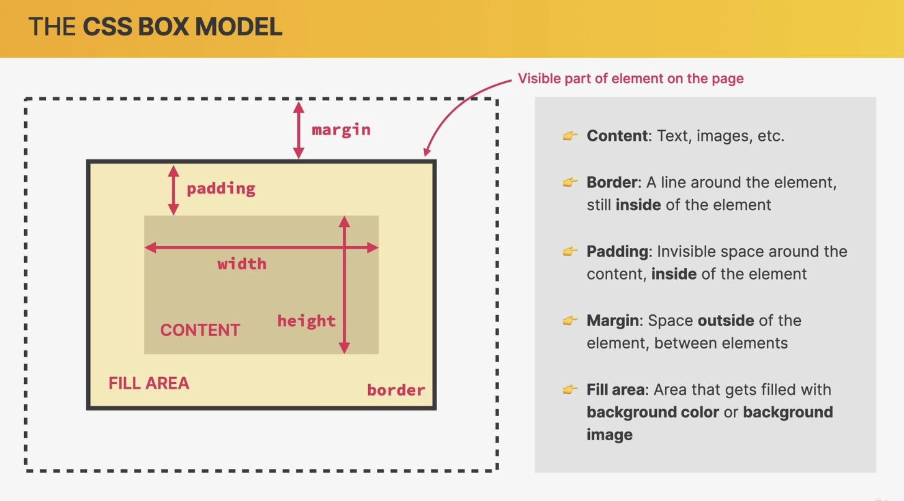
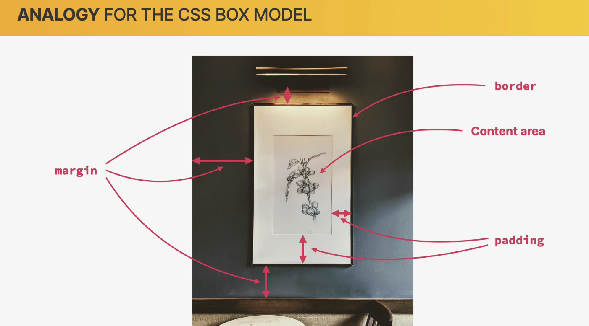
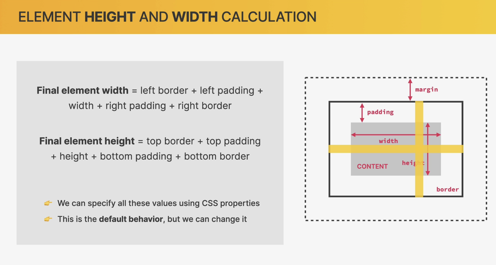

# [Course content](https://www.udemy.com/course/design-and-develop-a-killer-website-with-html5-and-css3/learn/lecture/27511920#overview)

Course content
## 1. Course Structure and Projects

## 2. Read Before You Start!

## 3. Migration Guide to v2

## 4. A High-Level Overview of Web Development

## 5. Setting Up Our Code Editor

## 6. Your Very First Webpage!

## 7. Downloading Course Material

## 8. Watch Before You Start!

## 9. Section Intro

## 10. Introduction to HTML

## 11. HTML Document Structure

## 12. Text Elements

## 13. More Text Elements: Lists

## 14. Images and Attributes

## 15. Hyperlinks

## 16. Structuring our Page

## 17. A Note on Semantic HTML

## 18. Installing Additional VS Code Extensions

## 19. CHALLENGE #1

## 20. CHALLENGE #2

## 21. Section Intro

## 22. Introduction to CSS

## 23. Inline, Internal and External CSS

## 24. Styling Text

## 25. Combining Selectors

## 26. Class and ID Selectors

## 27. Working With Colors

## 28. Pseudo-classes

## 29. Styling Hyperlinks

## 30. Using Chrome DevTools

## 31. CSS Theory #1: Conflicts Between Selectors

## 32. CSS Theory #2: Inheritance and the Universal Selector

## 33. CHALLENGE #1

## 34. CSS Theory #3: The CSS Box Model

## 35. Using Margins and Paddings

## 36. Adding Dimensions

## 37. Centering our Page

## 38. CHALLENGE #2

## 39. CSS Theory #4: Types of Boxes

## 40. CSS Theory #5: Absolute Positioning

## 41. Pseudo-elements

## 42. Developer Skill #1: Googling and Reading Documentation

## 43. Developer Skill #2: Debugging and Asking Questions

## 44. CHALLENGE #3

## 45. Section Intro

## 46. The 3 Ways of Building Layouts

## 47. Using Floats

## 48. Clearing Floats

## 49. Building a Simple Float Layout

## 50. box-sizing: border-box

## 51. CHALLENGE #1

## 52. Introduction to Flexbox

## 53. A Flexbox Overview

## 54. Spacing and Aligning Flex Items

## 55. The flex Property

## 56. Adding Flexbox to Our Project

## 57. Building a Simple Flexbox Layout

## 58. CHALLENGE #2

## 59. Introduction to CSS Grid

## 60. A CSS Grid Overview

## 61. Sizing Grid Columns and Rows

## 62. Placing and Spanning Grid Items

## 63. Aligning Grid Items and Tracks

## 64. Building a Simple CSS Grid Layout

## 65. CHALLENGE #3

## 66. Section Intro

## 67. Project Overview

## 68. Overview of Web Design and Website Personalities

## 69. Web Design Rules #1: Typography

## 70. Implementing Typography

## 71. Web Design Rules #2: Colors

## 72. Implementing Colors

## 73. Web Design Rules #3: Images and Illustrations

## 74. Web Design Rules #4: Icons

## 75. Implementing Icons

## 76. Web Design Rules #5: Shadows

## 77. Implementing Shadows

## 78. Web Design Rules #6: Border-radius

## 79. Implementing Border-radius

## 80. Web Design Rules #7: Whitespace

## 81. Web Design Rules #8: Visual Hierarchy

## 82. Implementing Whitespace and Visual Hierarchy

## 83. Web Design Rules #9: User Experience (UX)

## 84. The Website-Personalities-Framework

## 85. The Missing Piece: Steal Like An Artist!

## 86. Section Intro

## 87. Web Design Rules #10 - Part 1: Elements and Components

## 88. Building an Accordion Component - Part 1

## 89. Building an Accordion Component - Part 2

## 90. Building a Carousel Component - Part 1

## 91. Building a Carousel Component - Part 2

## 92. Building a Table Component - Part 1

## 93. Building a Table Component - Part 2

## 94. CHALLENGE #1: Building a Pagination Component

## 95. Web Design Rules #10 - Part 2: Layout Patterns

## 96. Building a Hero Section - Part 1

## 97. Building a Hero Section - Part 2

## 98. Building a Web Application Layout - Part 1

## 99. Building a Web Application Layout - Part 2

## 100. Section Intro

## 101. The 7 Steps to a Great Website

## 102. Defining and Planning the Project (Steps 1 and 2)

## 103. Sketching Initial Layout Ideas (Step 3)

## 104. First Design and Development Steps (Step 4)

## 105. Responsive Design Principles

## 106. How rem and max-width Work

## 107. Building the Hero - Part 1

## 108. Building the Hero - Part 2

## 109. Building the Hero - Part 3

## 110. Building the Header

## 111. Building the Navigation

## 112. Setting Up a Reusable Grid

## 113. Building the How-It-Works Section - Part 1

## 114. Building the How-It-Works Section - Part 2

## 115. Building the Featured-In Section

## 116. Building the Meals Section - Part 1

## 117. Building the Meals Section - Part 2

## 118. Building the Meals Section - Part 3

## 119. Building the Testimonials Section - Part 1

## 120. Building the Testimonials Section - Part 2

## 121. Building the Pricing Section - Part 1

## 122. Building the Pricing Section - Part 2

## 123. Building the Features Part

## 124. Building the Call-To-Action Section - Part 1

## 125. Building the Call-To-Action Section - Part 2

## 126. Building the Call-To-Action Section - Part 3

## 127. Building the Footer - Part 1

## 128. Building the Footer - Part 2

## 129. Section Intro

## 130. How Media Queries Work

## 131. How to Select Breakpoints

## 132. Responding to Small Laptops

## 133. Responding to Landscape Tablets

## 134. Responding to Tablets

## 135. Building the Mobile Navigation

## 136. Responding to Smaller Tablets

## 137. Responding to Phones

## 138. Section Intro

## 139. A Short Introduction to JavaScript

## 140. Making the Mobile Navigation Work

## 141. Implementing Smooth Scrolling

## 142. Implementing a Sticky Navigation Bar

## 143. Browser Support and Fixing Flexbox Gap in Safari

## 144. Testing Performance With Lighthouse

## 145. Adding Favicon and Meta Description

## 146. Image Optimizations

## 147. Deployment to Netlify

## 148. Making the Form Work With Netlify Forms

## 149. Where to Go from Here

## 150. Download the Old Course Version

